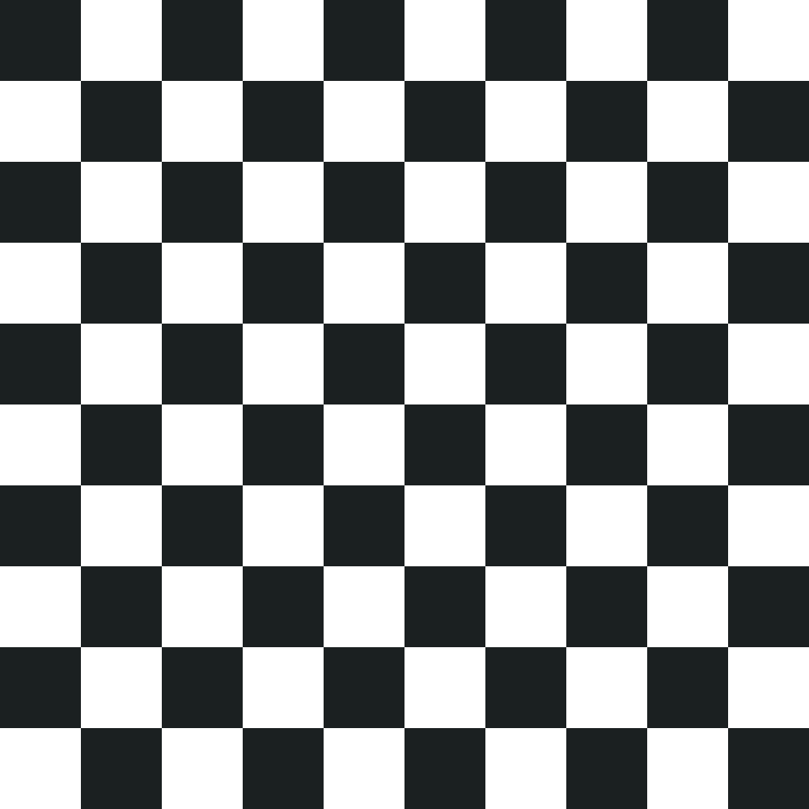

# Swift Loops Lab

## Introduction

#### What we are doing

In this lab, we will practice writing loops in Swift using `for` and `while` loops.

> ***Note:*** _This Lab should be done independently._

#### Why we are doing it

A loop is a fundamental programming concept. Loops allow you to repeat something many times. They are useful when you are searching, computing, or combining data.

## Exercise

Use `for` or `while` loops to solve these problems.

### Requirements

Using a new Playgrounds project, solve the following problems

**Basic**

+ Use a `for` loop to print the numbers from `1 - 100` (inclusive)
    + Write the while loop version

+ Use a `for` loop to print the numbers from `1 - 100` (exclusive). `print` "Odd" if the number is odd, "Even" if it is even.
    + Write the while loop version

**Logic**
+ The famous FizzBuzz problem! Write a program that loops through numbers 1 to 100: For numbers that are multiples of three print “Fizz”; for numbers that are multiples of five, print “Buzz”; for numbers that are multiples of both three and five print “FizzBuzz”; and for number that don't meet any of those requirements, just print the number.

**Math**

+ Using the Harmonic Series formula, compute the value for `n = 5,000`.
>

    > [More info here](http://www.mathsisfun.com/algebra/infinite-series.html). Scroll to where it says 'Harmonic Series"'

+ Use a loop to print all of the prime numbers from 1 to `p` for `p = 2,000`

+ Use a loop to multiply two numbers `234` and `3643` using only addition.
    + Use a loop to multiply 3 numbers, `3943, 21454534, 23`

+ Use a loop to calculate 15! ([Factorial](https://www.mathsisfun.com/numbers/factorial.html)).
    + Try 25!

**Grids**

+ Print a 10x10 checker board. Use the "◻︎" and "◼︎" symbols.
>  </img>
 + Each row should be on the same line

## Deliverables

Turn in your code in a single Playgrounds Project.

**Verify that**
+ Your code compiles
+ All the examples are solved using loops
+ Your code runs correctly
+ Your code produces the correct result

### Bonus Activities

+ Print the [Fibonacci Sequence](http://www.mathsisfun.com/numbers/fibonacci-sequence.html) until the number `1000`.

# Additional Resources

+ [Official Apple Developer Website](https://developer.apple.com/library/ios/navigation/)
+ [Swift Control Flow](https://developer.apple.com/library/ios/documentation/Swift/Conceptual/Swift_Programming_Language/ControlFlow.html#//apple_ref/doc/uid/TP40014097-CH9-ID120)
